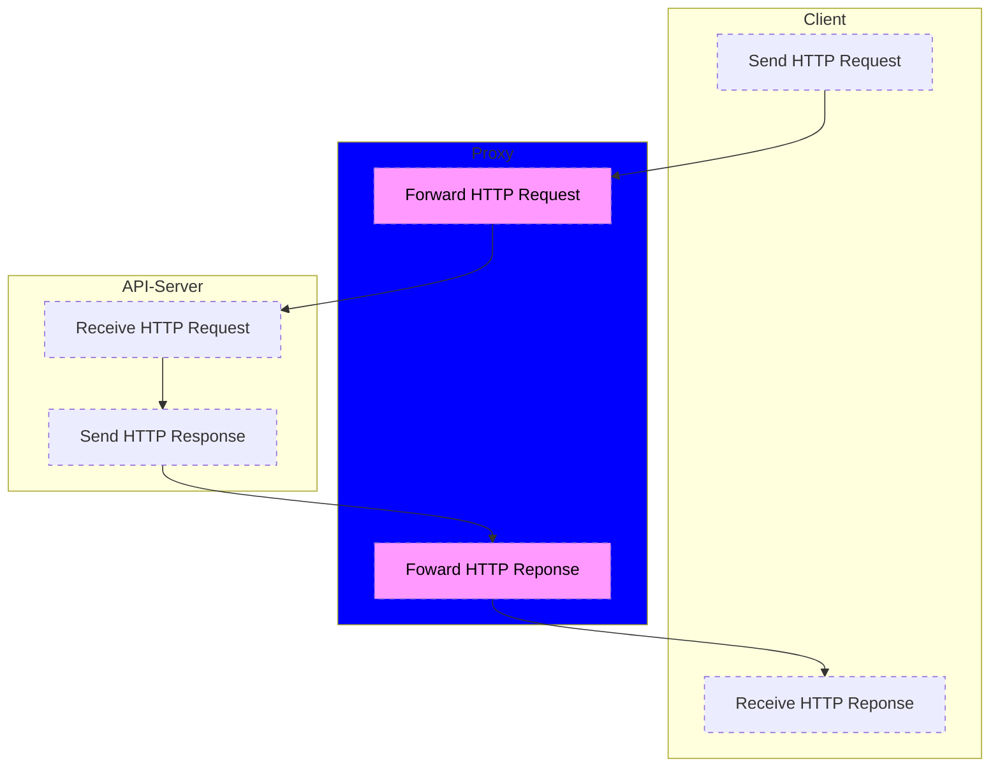

# API Proxy
## 概要
Web API サービスの api_key/api_secret を隠すために使用するプロキシサーバーです。  
NodeJS の express と http-proxy-middleware パッケージを使用したアプリです。

以下の書籍を参考に作成しました。
[「プロキシサーバーのつくりかた」](https://monotein.com/books/proxy-server-book)

## 構成図

## 動作イメージ
1. プロキシサーバーはクライアント(Webアプリなど)からHTTPリクエストを受信する
1. プロキシサーバーはAPIサーバーへHTTPリクエストを転送する
1. プロキシサーバーはAPIサーバーからHTTPレスポンスを受信する
1. プロキシサーバーはクライアントへHTTPレスポンスを転送する

## その他
今回のAPIサーバーはPOSTリクエストのみしか使用していないため、
POST以外のリクエスト(GET,DELETEなど)は素通しする。
